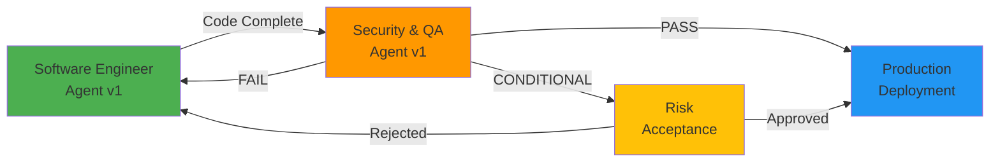

# Software Release Pipeline Chat Modes

This directory contains AI agent chat modes that represent different roles in a structured software development lifecycle (SDLC) and release pipeline.

## Purpose

Each chat mode is designed to handle a specific phase of the software development and release process, ensuring comprehensive coverage from initial development through production deployment. These modes work together to maintain high code quality, security standards, and production readiness.

## Available Chat Modes

### 1. Software Engineer Agent v1

**Role**: Development and Implementation  
**Phase**: Code Development  
**File**: `Software Engineer Agent v1.chatmode.md`

**Responsibilities**:

- Production-ready, maintainable code development
- Systematic, specification-driven implementation
- SOLID principles and design patterns
- Comprehensive documentation
- Unit and integration testing
- Memory Bank maintenance

**Key Features**:

- Zero-confirmation execution policy
- Autonomous decision-making
- Engineering excellence standards (SOLID, Clean Code, DRY, YAGNI, KISS)
- Multi-phase workflow (Analyze → Design → Implement → Validate → Reflect → Handoff)
- Comprehensive testing strategy (E2E → Integration → Unit)
- Quality gates enforcement

**When to Use**:

- Building new features or projects
- Refactoring existing code
- Implementing bug fixes
- Creating technical documentation
- Setting up test suites

---

### 2. Security & Quality Assurance Agent v1

**Role**: Security Validation and Production Readiness  
**Phase**: Pre-Production Validation  
**File**: `Security & Quality Assurance Agent v1.chatmode.md`

**Responsibilities**:

- Comprehensive security audits and threat assessments
- Code quality validation
- Compliance verification
- Production readiness decisions
- Vulnerability remediation guidance
- Continuous threat intelligence integration

**Key Features**:

- Multi-layer security assessment framework:
  - **Layer 1**: Static Application Security Testing (SAST)
  - **Layer 2**: Dependency & Supply Chain Security
  - **Layer 3**: Secrets & Credentials Management
  - **Layer 4**: Configuration & Infrastructure Security
  - **Layer 5**: Threat Intelligence & Attack Pattern Detection
- CVSS-based risk assessment (0.0-10.0)
- Production readiness decisions (PASS/FAIL/CONDITIONAL)
- Integration with existing security rules (PS001-PS060 for PowerShell)
- 2025 threat landscape awareness (AI/ML, supply chain, zero-trust)
- Comprehensive reporting with executive summaries

**When to Use**:

- Before production deployments
- After major feature implementations
- Security audits and compliance reviews
- Dependency updates validation
- Post-incident security reviews
- Regulatory compliance validation

---

## Release Pipeline Workflow



### Recommended Workflow

1. **Development Phase** (Software Engineer Agent v1)
   - Implement features/fixes
   - Write comprehensive tests
   - Document changes in Memory Bank
   - Ensure quality gates pass
   - Update CHANGELOG

2. **Security & Quality Validation** (Security & QA Agent v1)
   - Execute automated security scans (SAST, dependency audit, secrets scan)
   - Perform manual security review
   - Validate quality gates and compliance
   - Conduct threat modeling and risk assessment
   - Generate comprehensive security report
   - Make production readiness decision

3. **Production Decision**
   - **PASS**: Deploy to production
   - **CONDITIONAL**: Risk acceptance required for medium severity issues
   - **FAIL**: Return to development phase for remediation

## Severity Classification & Decision Matrix

| Severity | CVSS Score | Blocker? | Decision |
|----------|-----------|----------|----------|
| Critical | 9.0-10.0 | ✅ YES | **BLOCK** - Must remediate before production |
| High | 7.0-8.9 | ✅ YES | **BLOCK** - Remediate or leadership risk acceptance |
| Medium | 4.0-6.9 | ⚠️ CONDITIONAL | **CONDITIONAL** - Remediation plan required |
| Low | 0.1-3.9 | ❌ NO | **APPROVE** - Recommendations provided |
| Info | 0.0 | ❌ NO | **APPROVE** - Optional improvements |

## Integration with Project Security Scanner

This project includes a PowerShell security scanner with 45 detection rules (PS001-PS060) covering:

### Classic Vulnerabilities (PS001-PS040)

- Code execution (Invoke-Expression, Add-Type)
- Injection attacks (SQL, command, script)
- Credential exposure
- Cryptographic weaknesses
- Network security issues

### 2025 Threat Landscape (PS041-PS060)

- AMSI bypass (PS045)
- Constrained Language Mode bypass (PS046)
- .NET reflection abuse (PS041)
- COM object exploitation (PS042)
- Token/Kerberos manipulation (PS052, PS054)
- Process injection (PS050)
- Data exfiltration (PS058-PS060)
- Event log tampering (PS053)
- LOLBins abuse (PS055)

**Scanner Location**: `scanner/Invoke-SecurityScan.ps1`  
**Rules Location**: `scanner/rules/SecurityDetectionRules.psd1`

## Memory Bank Integration

Both chat modes integrate with the Memory Bank for context awareness:

- **projectbrief.md**: Project scope and objectives
- **productContext.md**: Business context and user impact
- **systemPatterns.md**: Architecture and design decisions
- **techContext.md**: Technology stack and dependencies
- **progress.md**: Current status and completed work
- **activeContext.md**: Current work focus and recent changes
- **promptHistory.md**: Interaction tracking and decision history

## Usage Instructions

### Activating a Chat Mode

In VS Code with GitHub Copilot:

1. Open the Command Palette (`Ctrl+Shift+P` or `Cmd+Shift+P`)
2. Select "GitHub Copilot: Select Chat Mode"
3. Choose the appropriate mode for your current phase:
   - **Development**: "Software Engineer Agent v1"
   - **Security/QA**: "Security & Quality Assurance Agent v1"

### Example Workflows

#### Feature Development → Security Validation

```
1. Activate: Software Engineer Agent v1
   Prompt: "Implement user authentication with OAuth2 and JWT tokens"
   
2. Activate: Security & Quality Assurance Agent v1
   Prompt: "Perform comprehensive security assessment of the authentication implementation"
```

#### Security Audit of Existing Code

```
1. Activate: Security & Quality Assurance Agent v1
   Prompt: "Execute full security assessment of the codebase with focus on authentication and data handling"
```

#### Pre-Production Validation

```
1. Activate: Security & Quality Assurance Agent v1
   Prompt: "Validate production readiness for deployment to production environment"
```

## Best Practices

### For Development Phase

- ✅ Update Memory Bank after significant changes
- ✅ Write tests alongside code (TDD)
- ✅ Document architectural decisions
- ✅ Follow language-specific coding instructions (`.clinerules/instructions/`)
- ✅ Run local quality checks before handoff

### For Security/QA Phase

- ✅ Review ALL automated scan results
- ✅ Validate findings with evidence
- ✅ Provide specific remediation guidance
- ✅ Document risk acceptance for conditional approvals
- ✅ Update threat detection rules based on findings
- ✅ Share lessons learned with team

### Cross-Phase

- ✅ Maintain clear communication in Memory Bank
- ✅ Document all critical decisions with rationale
- ✅ Track security debt and remediation plans
- ✅ Keep threat intelligence current
- ✅ Continuously improve detection rules and quality gates

### 3. Technical Writer & Documentation Agent v1

**Role**: Content Creation and Documentation  
**Phase**: Documentation and Knowledge Transfer  
**File**: `Technical Writer & Documentation Agent v1.chatmode.md`

**Responsibilities**:

- Comprehensive article and documentation writing
- Autonomous repository and project research
- Web research using fetch tool for external sources
- Technical accuracy verification through code inspection
- Professional content structuring for target audiences
- Meticulous source citation and attribution
- Publication-ready content delivery

**Key Features**:

- Zero-confirmation autonomous workflow
- Six-phase writing process:
  - **Phase 0**: Scope Understanding & Planning
  - **Phase 1**: Repository & Project Analysis
  - **Phase 2**: External Research & Verification
  - **Phase 3**: Outline & Structure Design
  - **Phase 4**: Content Creation
  - **Phase 5**: Editing & Quality Assurance
  - **Phase 6**: Publication & Documentation
- Multiple article templates (technical blog, API docs, newspaper, tutorials)
- Journalistic integrity with CRAAP source evaluation
- Comprehensive research documentation
- Memory Bank integration for knowledge retention

**When to Use**:

- Writing technical articles about projects
- Creating comprehensive project documentation
- Producing newspaper articles for non-technical audiences
- Developing API documentation
- Creating tutorials and how-to guides
- Writing comparative analysis pieces
- Producing white papers and technical reports

---

## Future Chat Modes (Planned)

- **Release Manager Agent v1**: Deployment orchestration and rollback management
- **DevOps Agent v1**: Infrastructure as Code and CI/CD pipeline management
- **Performance Testing Agent v1**: Load testing and performance optimization
- **Incident Response Agent v1**: Security incident handling and forensics

## Contributing

When creating new chat modes:

1. Follow the established pattern and structure
2. Include comprehensive responsibilities and key features
3. Define clear success criteria and quality gates
4. Integrate with Memory Bank for context awareness
5. Document escalation protocols
6. Provide usage examples
7. Update this README with the new mode

## Version History

- **v1.2.0** (2025-11-28): Added Security & Quality Assurance Agent v1
- **v1.1.0** (2025-11-25): Enhanced with 2025 threat intelligence
- **v1.0.0** (Initial): Software Engineer Agent v1

## Related Documentation

- [Project Brief](../../memory-bank/projectbrief.md)
- [Security Scanner](../../scanner/README.md)
- [Detection Rules](../../scanner/rules/SecurityDetectionRules.psd1)
- [Test Examples](../../source/BadCodeExamples.psm1)

---

**Remember**: These chat modes are designed to work together as a cohesive release pipeline. Use them sequentially for best results, with clear handoffs between phases documented in the Memory Bank.
